# 🌴 Oasi

> **An intelligent productivity suite that combines AI-powered note-taking, job management, calendar organization, and task tracking in one unified platform.**


## 📚 Table of Contents

- [Overview](#-overview)
- [Key Features](#-key-features)
  - [Smart Note-Taking](#-smart-note-taking)
  - [AI-Powered Chat](#-ai-powered-chat)
  - [Job Management & Scraping](#-job-management--scraping)
  - [Calendar & Scheduling](#-calendar--scheduling)
  - [Task Management](#-task-management)
  - [Shopping Lists](#-shopping-lists)
  - [Custom AI Agents](#-custom-ai-agents)
  - [Tag Management](#-tag-management)
- [Demo Screenshots](#-demo--screenshots)
- [Getting Started](#-getting-started)
- [Configuration](#-configuration)
- [Usage Guide](#-usage-guide)
- [Tech Stack](#-tech-stack)
- [Roadmap](#-roadmap)
- [Contributing](#-contributing)
- [License](#-license)

## 🌟 Overview

Oasi is a comprehensive productivity platform that leverages AI to enhance your workflow across multiple domains. From intelligent note-taking with RAG capabilities to automated job searching and calendar management, this application provides a unified interface for managing your professional and personal life.

## 🚀 Key Features

### 📝 Smart Note-Taking

Experience next-generation note-taking with AI-powered features, rich text editing, and intelligent organization.

- **Hierarchical Organization**: Create folders and organize notes in a tree structure
- **Rich Text Editor**: EditorJS-powered editor with headers, lists, code blocks, quotes, and images
- **AI-Enhanced Toolbar**: Intelligent suggestions and content generation directly in your notes
- **Real-time Saving**: Auto-save functionality to prevent data loss
- **Multiple Export Formats**: Export notes as PDF, Markdown, or JSON

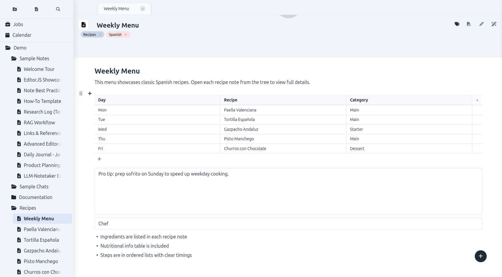

**AI-Powered Inline Toolbar**
Get intelligent writing assistance with context-aware suggestions and content generation directly within your notes.

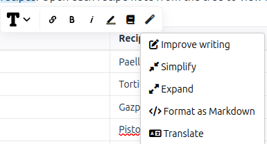

### 💬 AI-Powered Chat

Engage with advanced language models in an intuitive chat interface with document integration and conversation management.

- **Multiple LLM Support**: Chat with local models via Ollama or cloud-based services
- **Model Selection**: Choose from various AI models for different tasks
- **Document Integration**: Upload and chat with your documents using RAG technology
- **Persistent History**: Organized conversation history with folder structure
- **Context-Aware Responses**: Maintains conversation context across sessions

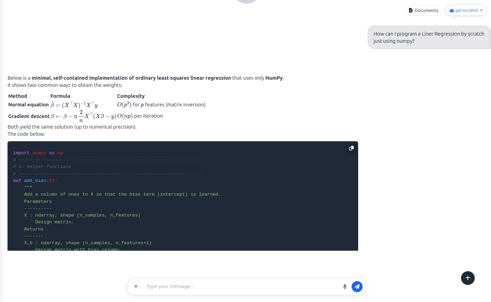

**Advanced Model Selection**
Choose the right AI model for your specific needs with an intuitive model selection interface.

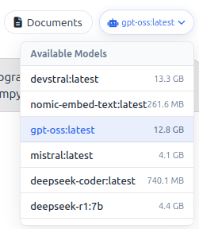

**Document-Enhanced Conversations**
Chat with your documents and get intelligent responses based on your uploaded content.

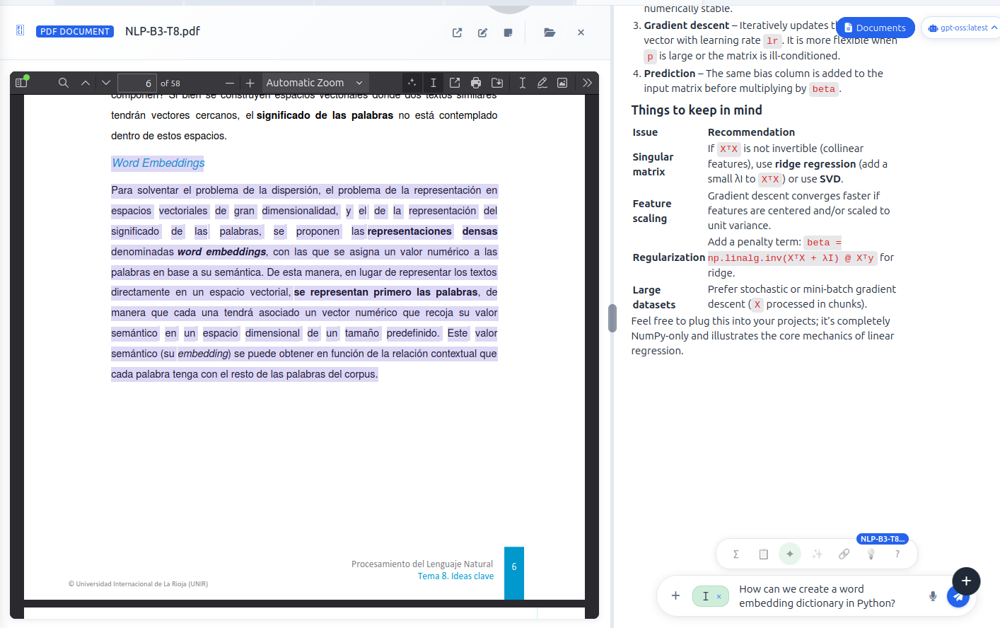

### 💼 Job Management & Scraping

Streamline your job search with automated scraping, intelligent matching, and comprehensive job management.

- **Automated Job Scraping**: Configure automatic job searches across multiple platforms
- **Manual Job Search**: Perform targeted searches with custom parameters
- **Job Dashboard**: Comprehensive overview of your job applications and opportunities
- **Application Tracking**: Monitor application status and interview schedules
- **Smart Filtering**: AI-powered job matching based on your preferences

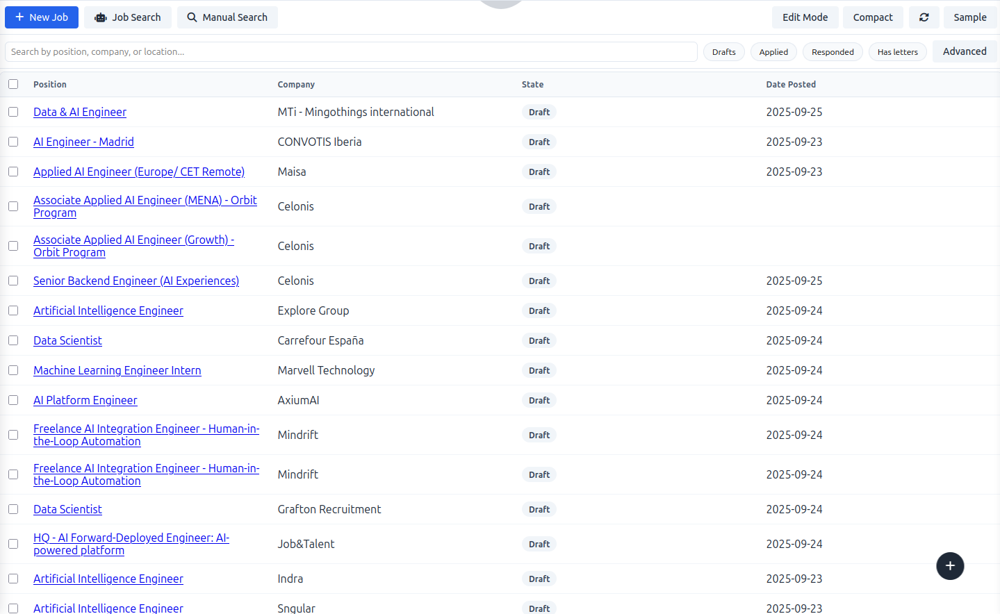

**Automated Job Scraping Configuration**
Set up automated job searches with customizable parameters and scheduling.

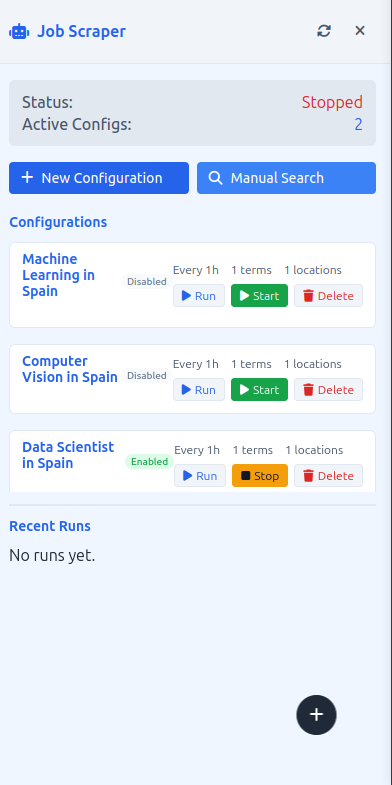

**Manual Job Search**
Perform targeted job searches with real-time results and advanced filtering options.

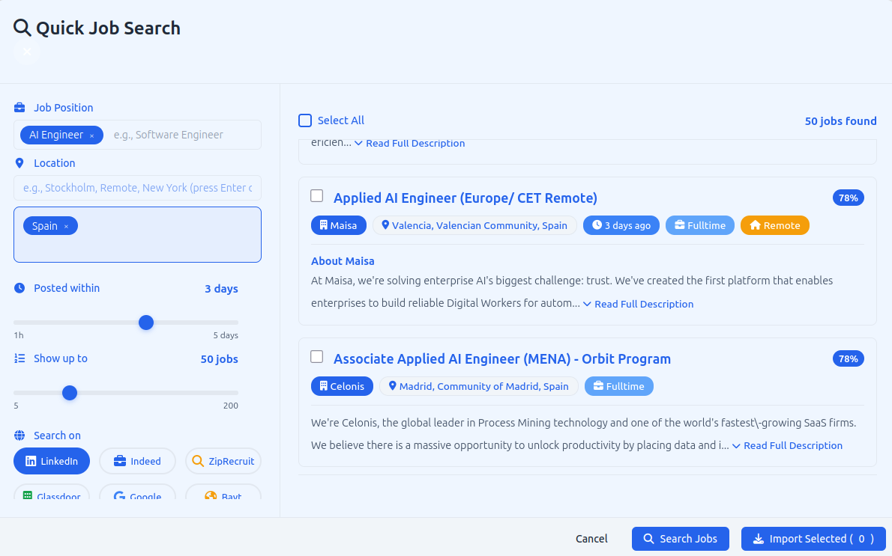

**Detailed Job Information**
View comprehensive job details with company information, requirements, and application tracking.

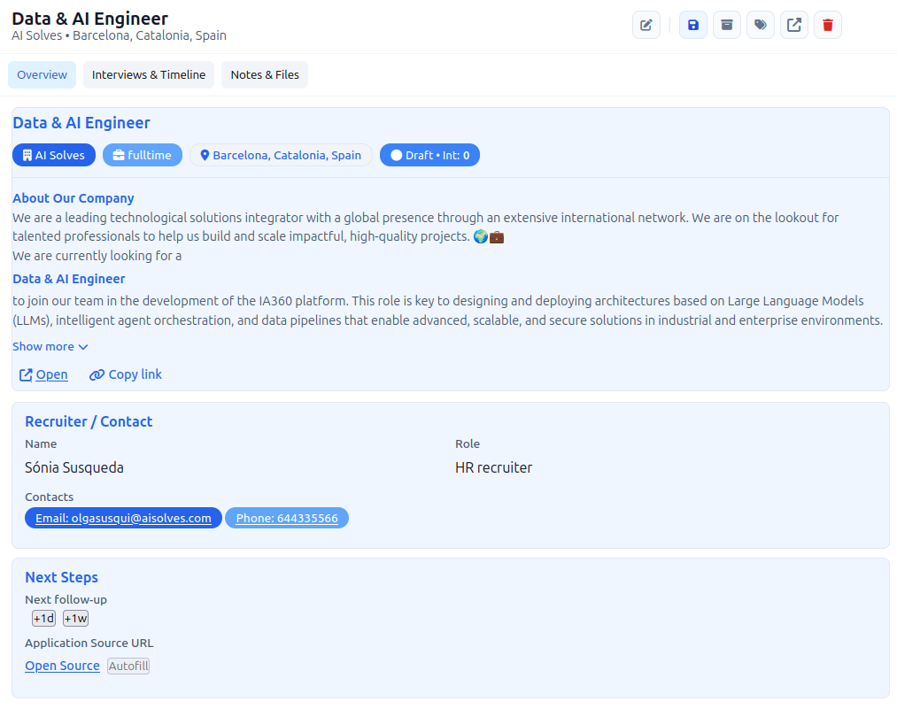

### 📅 Calendar & Scheduling

Organize your time effectively with multiple calendar views and intelligent scheduling features.

- **Multiple View Modes**: Month, week, and day views for different planning needs
- **Event Management**: Create, edit, and organize events with rich metadata
- **Integration Ready**: Connect with external calendar services
- **Smart Scheduling**: AI-assisted optimal time slot suggestions
- **Reminder System**: Automated notifications and reminders

**Monthly Calendar View**
Get a comprehensive overview of your month with all events and deadlines at a glance.

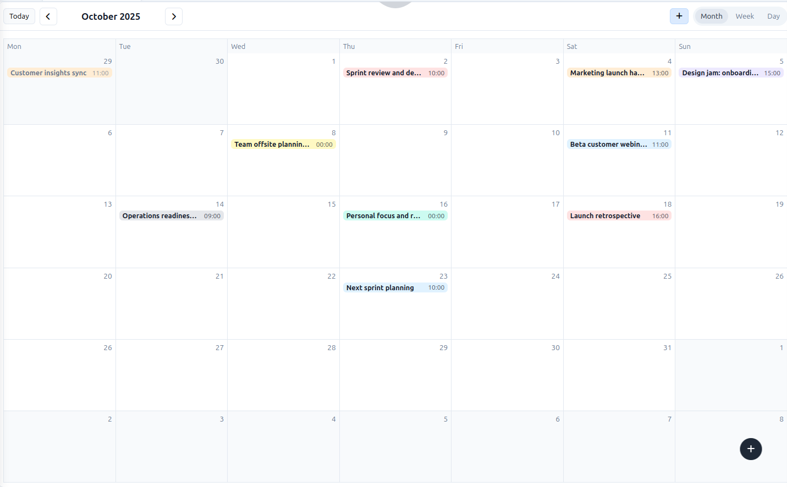

**Weekly Calendar View**
Detailed weekly planning with time-blocked scheduling and event management.

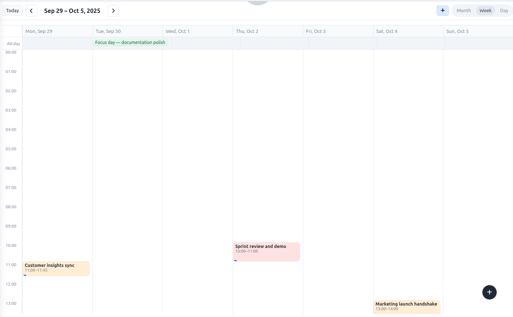

### ✅ Task Management

Boost your productivity with advanced task management featuring the Eisenhower Matrix and custom lists.

- **Eisenhower Matrix**: Organize tasks by urgency and importance
- **Custom Task Lists**: Create personalized task categories and workflows
- **Priority Management**: Visual priority indicators and sorting
- **Progress Tracking**: Monitor task completion and productivity metrics
- **Smart Scheduling**: Integrate tasks with calendar for optimal planning

**Eisenhower Matrix Task Organization**
Prioritize your tasks using the proven Eisenhower Matrix methodology for maximum productivity.

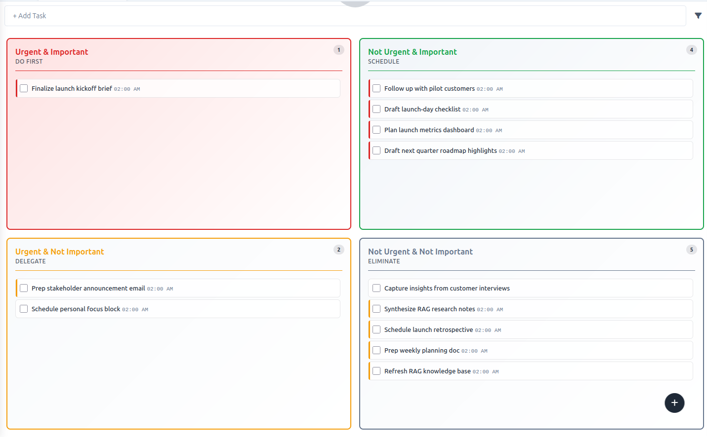

**Custom Task Lists**
Create and manage custom task categories tailored to your specific workflow and projects.

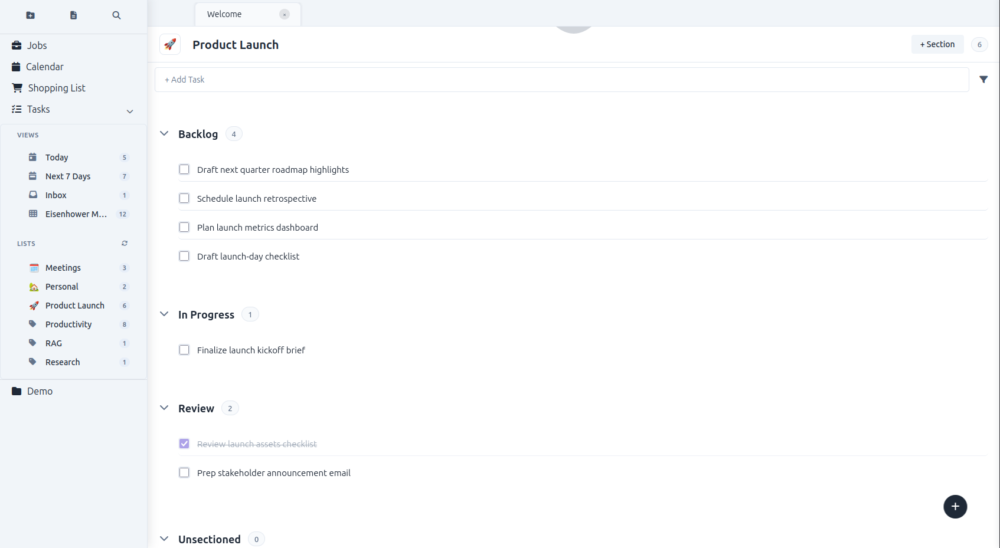

**Weekly Task Overview with Details**
Get a comprehensive weekly view of your tasks with detailed information and progress tracking.

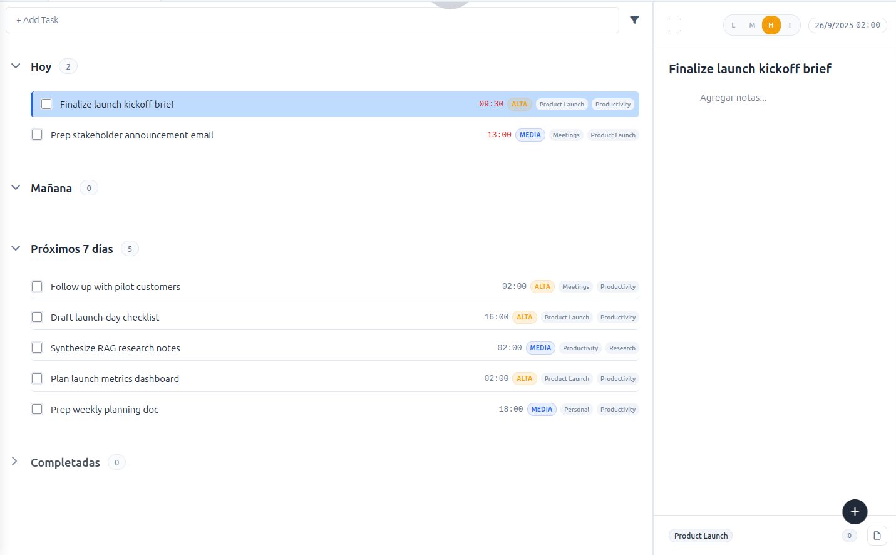

### 🛒 Shopping Lists

Organize your shopping with intelligent list management and recipe integration.

- **Smart Shopping Lists**: AI-powered grocery list generation
- **Recipe Integration**: Automatically generate shopping lists from recipes
- **Ingredient Management**: Organize by categories and dietary preferences
- **Multi-Store Support**: Organize lists by different stores or locations
- **Sharing Capabilities**: Collaborate on shopping lists with family members

**Comprehensive Shopping List Management**
View all your ingredients organized by categories with smart suggestions and nutritional information.


**Recipe-Based Shopping Lists**
Generate shopping lists automatically from your favorite recipes with precise ingredient quantities.


### 🤖 Custom AI Agents

Create and deploy specialized AI agents tailored to your specific needs and workflows.

- **Agent Builder**: Create custom AI agents with specific knowledge and capabilities
- **Workflow Integration**: Deploy agents across different application modules
- **Knowledge Base Integration**: Train agents on your personal documents and data
- **Multi-Agent Coordination**: Orchestrate multiple agents for complex tasks
- **Performance Analytics**: Monitor agent effectiveness and optimization

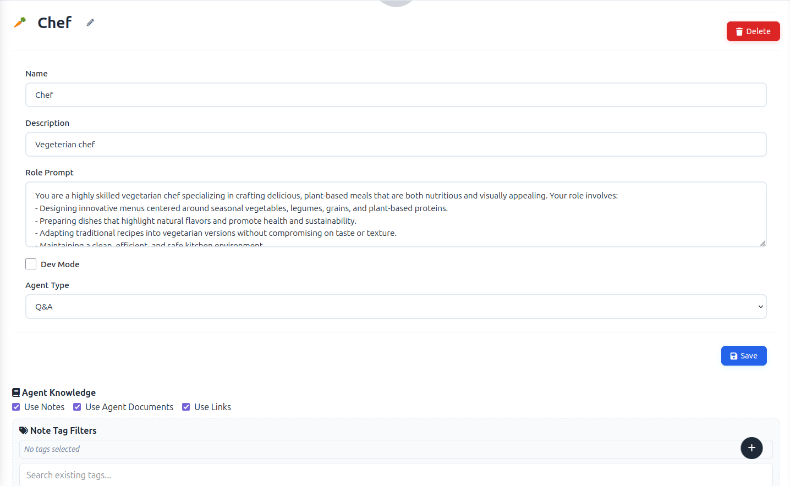

### 🏷️ Tag Management

Organize and manage your content with intelligent tagging systems and content review capabilities.

- **Hierarchical Tags**: Create nested tag structures for complex organization
- **Content Review**: Review and manage tagged content across all modules
- **Auto-Tagging**: AI-powered automatic tag suggestions
- **Tag Analytics**: Insights into your content organization patterns
- **Cross-Module Tagging**: Unified tagging system across notes, tasks, and other content

**Advanced Tag Management Interface**
Organize your content with a sophisticated tagging system that works across all application modules.

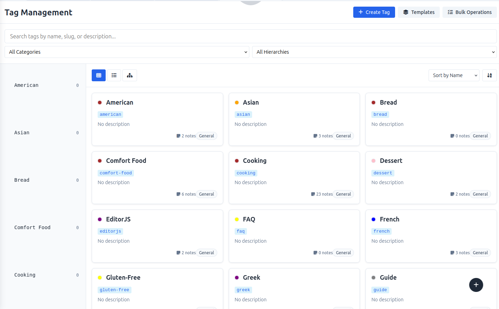

**Content Review by Tags**
Review and manage all content associated with specific tags for better organization and discovery.

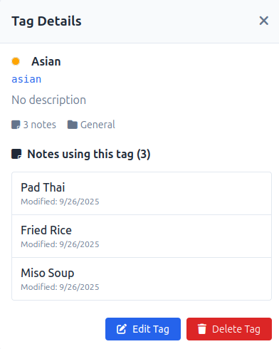

## � Demo / Screenshots

### Application Overview
Experience the full power of the Oasi platform through these comprehensive interface demonstrations:


## 🛠️ Getting Started

### Prerequisites

Before installing Oasi, ensure you have the following:

- **Python 3.8 or higher** - [Download Python](https://python.org/downloads/)
- **Node.js 16+** (for frontend build tools) - [Download Node.js](https://nodejs.org/)
- **Git** - [Download Git](https://git-scm.com/)
- **[Ollama](https://ollama.ai/)** - For local LLM support (optional but recommended)

### Quick Installation

1. **Clone the repository**
   ```bash
   git clone https://github.com/sardinaa/Oasi.git
   cd Oasi
   ```

2. **Automated setup (Recommended)**
   ```bash
   chmod +x config/dev_setup.sh
   ./config/dev_setup.sh
   ```
   
   This script automatically:
   - Creates and activates a Python virtual environment
   - Installs all Python dependencies from requirements.txt
   - Downloads and configures PDF.js viewer
   - Sets up necessary directories and permissions
   - Configures development environment

3. **Manual setup (Alternative)**
   
   **Create virtual environment**
   ```bash
   python -m venv notetaker
   source notetaker/bin/activate  # Linux/Mac
   # Or on Windows: notetaker\Scripts\activate
   ```

   **Install Python dependencies**
   ```bash
   pip install -r requirements.txt
   ```

   **Install Node.js dependencies** (for frontend build tools)
   ```bash
   npm install
   ```

   **Configure PDF.js viewer**
   ```bash
   chmod +x config/setup_pdfjs.sh
   ./config/setup_pdfjs.sh
   ```

4. **Set up Ollama (Optional)**
   
   For local AI model support:
   ```bash
   # Install Ollama from https://ollama.ai/
   # Then pull recommended models:
   ollama pull mistral:latest
   ollama pull nomic-embed-text
   ollama pull llama3.2:latest
   ```

5. **Initialize the database**
   ```bash
   python seed_demo_db.py  # Creates demo data (optional)
   ```

6. **Launch the application**
   ```bash
   python app.py
   ```

7. **Access the platform**
   Open your browser and navigate to: `http://localhost:5000`

### Docker Installation (Alternative)

For containerized deployment:

```bash
# Build the Docker image
docker build -t Oasi .

# Run the container
docker run -p 5000:5000 -v $(pwd)/data:/app/data Oasi
```

## � Configuration

### Environment Variables

Create a `.env` file in the root directory with the following configuration:

```bash
# Database Configuration
DATABASE_PATH=instance/notetaker.db
FLASK_ENV=development
FLASK_DEBUG=True

# AI Model Configuration
OLLAMA_BASE_URL=http://127.0.0.1:11434
DEFAULT_LLM_MODEL=mistral:latest
DEFAULT_EMBEDDING_MODEL=nomic-embed-text

# Audio Configuration
WHISPER_MODEL=base
TTS_VOICE=female_1

# Job Scraping Configuration
JOB_SCRAPER_ENABLED=True
JOB_SCRAPER_INTERVAL=3600  # seconds

# File Upload Configuration
MAX_CONTENT_LENGTH=16777216  # 16MB
UPLOAD_FOLDER=instance/uploads

# Security Configuration
SECRET_KEY=your-secret-key-here
```

### Model Configuration

The application supports various AI models. Configure them in the settings:

**LLM Models (via Ollama)**
- `mistral:latest` - General purpose conversational AI
- `llama3.2:latest` - Advanced reasoning and code generation
- `codellama:latest` - Specialized for code-related tasks
- `phi3:latest` - Lightweight model for quick responses

**Embedding Models**
- `nomic-embed-text` - High-quality text embeddings
- `all-minilm` - Lightweight embedding model

### Advanced Configuration

**RAG Settings** (in `services/rag_manager.py`)
```python
# Chunk size for document processing
CHUNK_SIZE = 1000
CHUNK_OVERLAP = 200

# Retrieval parameters
TOP_K_DOCUMENTS = 5
SIMILARITY_THRESHOLD = 0.7
```

**Audio Settings** (in `app.py`)
```python
# Whisper model options: tiny, base, small, medium, large
WHISPER_MODEL = "base"

# TTS voice options
TTS_VOICES = ["female_1", "female_2", "male_1", "male_2"]
```

## 📖 Usage Guide

### Quick Start Workflow

1. **Launch the Application**
   - Start the server with `python app.py`
   - Navigate to `http://localhost:5000`
   - The application opens with a clean dashboard interface

2. **Create Your First Note**
   - Click "New Note" in the sidebar
   - Use the rich text editor with AI-enhanced toolbar
   - Organize notes in folders for better structure
   - Auto-save keeps your work secure

3. **Set Up AI Chat**
   - Navigate to the Chat tab
   - Select your preferred AI model
   - Upload documents for enhanced context
   - Start conversations with intelligent responses

4. **Configure Job Searching**
   - Go to Jobs section
   - Set up automatic job scraping parameters
   - Define your preferences and criteria
   - Monitor opportunities on the dashboard

### Advanced Features

#### Document RAG Integration
1. **Upload Documents**: Support for PDF, Word, PowerPoint, CSV, and text files
2. **Automatic Indexing**: Documents are processed and indexed for semantic search
3. **Intelligent Querying**: Ask questions in natural language about your documents
4. **Source References**: Get answers with direct citations to source material

#### Task Management with Eisenhower Matrix
1. **Categorize Tasks**: Organize by urgency and importance
2. **Visual Planning**: Drag-and-drop interface for easy organization  
3. **Progress Tracking**: Monitor completion rates and productivity metrics
4. **Calendar Integration**: Schedule tasks directly from the matrix

#### Custom AI Agents
1. **Agent Creation**: Build specialized AI agents for specific domains
2. **Knowledge Training**: Train agents on your personal documents
3. **Workflow Integration**: Deploy agents across different modules
4. **Performance Analytics**: Monitor and optimize agent effectiveness

#### Smart Shopping Lists
1. **Recipe Integration**: Generate lists automatically from recipes
2. **Ingredient Organization**: Smart categorization and suggestions
3. **Multi-Store Planning**: Organize by different shopping locations
4. **Collaborative Lists**: Share and collaborate with family members

## 🏗️ Tech Stack

### Backend Technologies
- **Flask** - Web framework and API server
- **SQLite** - Primary database with SQLAlchemy ORM
- **ChromaDB** - Vector database for RAG embeddings
- **Ollama** - Local LLM integration and management
- **OpenAI Whisper** - Speech-to-text transcription
- **Kokoro TTS** - Text-to-speech synthesis
- **LangChain** - RAG pipeline and document processing
- **Unstructured** - Document parsing and extraction

### Frontend Technologies
- **Vanilla JavaScript** - Modern ES6+ frontend
- **EditorJS** - Rich text editor with plugins
- **SCSS/Sass** - Stylesheet preprocessing
- **Rollup** - Module bundler for JavaScript
- **PDF.js** - In-browser PDF viewing and annotation

### AI & Machine Learning
- **Mistral/Llama Models** - Large language models via Ollama
- **Nomic Embeddings** - Text embeddings for semantic search
- **Sentence Transformers** - Document similarity and retrieval
- **NumPy/SciPy** - Numerical computing for AI operations

### DevOps & Infrastructure
- **Python Virtual Environments** - Dependency isolation
- **Git** - Version control and collaboration
- **Shell Scripts** - Automated setup and deployment
- **Docker** - Containerization support (optional)

### Architecture Overview

```
┌─────────────────┬─────────────────┬─────────────────┐
│   Frontend      │   Backend       │   AI Services   │
├─────────────────┼─────────────────┼─────────────────┤
│ EditorJS        │ Flask Routes    │ Ollama LLMs     │
│ JavaScript ES6+ │ SQLAlchemy ORM  │ Whisper STT     │
│ SCSS Styles     │ Data Service    │ Kokoro TTS      │
│ PDF.js Viewer   │ RAG Manager     │ ChromaDB        │
└─────────────────┴─────────────────┴─────────────────┘
         │                 │                 │
         └─────────────────┼─────────────────┘
                           │
                    ┌─────────────────┐
                    │   SQLite DB     │
                    │   File Storage  │
                    │   Vector Store  │
                    └─────────────────┘
```

### Key Architectural Principles

- **Modular Design**: Separate services for different functionalities
- **API-First**: RESTful API design with clear separation of concerns
- **Scalable RAG**: Vector database integration for intelligent document retrieval
- **Real-time Features**: WebSocket support for live updates
- **Plugin Architecture**: Extensible system for custom AI agents and features

## �️ Roadmap

### Version 2.0 (Q1 2026)
- [ ] **Multi-User Support**
  - User authentication and authorization
  - Workspace sharing and collaboration
  - Role-based access control
  
- [ ] **Cloud Integration**
  - Cloud storage synchronization (Google Drive, Dropbox)
  - Real-time collaborative editing
  - Cross-device synchronization

### Version 2.1 (Q2 2026)
- [ ] **Mobile Applications**
  - Native iOS and Android apps
  - Offline functionality
  - Voice-first interaction modes

- [ ] **Advanced AI Features**
  - Custom model fine-tuning
  - Multi-modal AI (vision, audio, text)
  - Automated workflow suggestions

### Version 2.2 (Q3 2026)
- [ ] **Enterprise Features**
  - SSO integration (SAML, OAuth)
  - Advanced security and compliance
  - Team analytics and reporting

- [ ] **Plugin Ecosystem**
  - Third-party integrations (Slack, Notion, Trello)
  - Custom plugin development framework
  - Community marketplace

### Long-term Vision
- [ ] **AI-Powered Insights**
  - Predictive task management
  - Intelligent content recommendations
  - Automated workflow optimization

- [ ] **Advanced Collaboration**
  - Real-time co-editing
  - Shared AI agents and knowledge bases
  - Team productivity analytics

## 🤝 Contributing

We welcome contributions from the community! Here's how you can help make Oasi even better:

### Getting Started

1. **Fork the Repository**
   ```bash
   # Fork on GitHub, then clone your fork
   git clone https://github.com/YOUR-USERNAME/Oasi.git
   cd Oasi
   ```

2. **Set Up Development Environment**
   ```bash
   # Create a new branch for your feature
   git checkout -b feature/amazing-new-feature
   
   # Install development dependencies
   pip install -r requirements.txt
   npm install
   ```

3. **Make Your Changes**
   - Write clean, documented code
   - Follow existing code style and conventions
   - Add tests for new functionality
   - Update documentation as needed

4. **Test Your Changes**
   ```bash
   # Run the application locally
   python app.py
   
   # Test your changes thoroughly
   # Add unit tests in the tests/ directory
   ```

5. **Submit Your Contribution**
   ```bash
   # Commit your changes with descriptive messages
   git commit -m "Add: Innovative feature that improves user experience"
   
   # Push to your fork
   git push origin feature/amazing-new-feature
   
   # Create a Pull Request on GitHub
   ```

### Contribution Guidelines

- **Code Quality**: Follow PEP 8 for Python and use meaningful variable names
- **Documentation**: Update README.md and add inline comments for complex logic
- **Testing**: Include unit tests for new features and bug fixes
- **Commit Messages**: Use clear, descriptive commit messages
- **Issue Tracking**: Reference related issues in your pull requests

### Areas for Contribution

- 🐛 **Bug Fixes**: Help identify and resolve issues
- ✨ **New Features**: Implement items from our roadmap
- 📚 **Documentation**: Improve guides and API documentation  
- 🎨 **UI/UX**: Enhance the user interface and experience
- 🧪 **Testing**: Expand test coverage and quality
- 🔧 **DevOps**: Improve deployment and CI/CD processes

## 📄 License

This project is licensed under the **MIT License** - see the [LICENSE](LICENSE) file for complete details.

### What this means:
- ✅ **Commercial Use**: You can use this software for commercial purposes
- ✅ **Modification**: You can modify the source code
- ✅ **Distribution**: You can distribute the original or modified software
- ✅ **Private Use**: You can use the software privately
- ❗ **Limitation**: The software is provided "as is", without warranty

## 🙏 Acknowledgments

Special thanks to the amazing open-source community and these fantastic projects:

### Core Technologies
- **[Ollama](https://ollama.ai/)** - Local LLM deployment and management
- **[Flask](https://flask.palletsprojects.com/)** - Lightweight and flexible web framework
- **[ChromaDB](https://www.trychroma.com/)** - AI-native vector database
- **[LangChain](https://langchain.com/)** - RAG implementation and AI orchestration

### AI & ML Libraries  
- **[OpenAI Whisper](https://github.com/openai/whisper)** - State-of-the-art speech recognition
- **[Kokoro TTS](https://github.com/synthspeech/kokoro)** - High-quality text-to-speech
- **[Sentence Transformers](https://www.sbert.net/)** - Semantic embeddings and similarity

### Frontend Tools
- **[EditorJS](https://editorjs.io/)** - Modern rich text editor
- **[PDF.js](https://mozilla.github.io/pdf.js/)** - In-browser PDF rendering
- **[Rollup](https://rollupjs.org/)** - Next-generation JavaScript bundler

### Development Tools
- **[Python](https://python.org/)** - The programming language that powers our backend
- **[SQLAlchemy](https://sqlalchemy.org/)** - Powerful Python ORM
- **[Unstructured](https://unstructured.io/)** - Document parsing and processing

## � Community & Support

### Get Help
- 📖 **[Documentation](docs/)** - Comprehensive guides and API reference
- 🐛 **[Issues](https://github.com/sardinaa/Oasi/issues)** - Report bugs or request features
- 💡 **[Discussions](https://github.com/sardinaa/Oasi/discussions)** - Community support and ideas
- 📧 **Email**: [Contact the maintainer](mailto:your-email@example.com)

### Stay Connected
- ⭐ **Star this repository** to show your support
- 👀 **Watch** for updates and releases
- 🍴 **Fork** to start contributing
- 📢 **Share** with your network

---

<div align="center">

**Made with ❤️ by the Oasi Community**

[](https://github.com/sardinaa/Oasi/stargazers)
[](https://github.com/sardinaa/Oasi/network/members)
[](https://github.com/sardinaa/Oasi/watchers)

</div>
